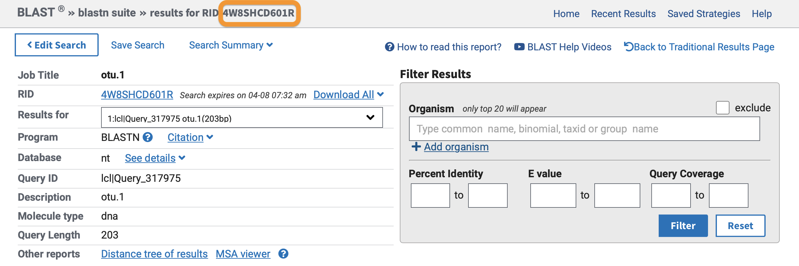

# LCA_BLAST_calculator

## Introduction

The LCA_BLAST_calculator program parses a BLAST output file and assigns a lowest common ancestor (LCA) to each submitted sequence using user-defined parameter thresholds for percent identity and query coverage. The LCA_BLAST_calculator program outputs the LCA taxonomic lineages in a tab-delimited document containing four columns, including (i) query sequence ID, (ii) taxonomic rank achieved, (iii) number of BLAST hits that passed the filter threshold and were used to calculate the LCA, and (iv) the taxonomic lineage of the LCA. If a frequency table (OTU table) is provided, the four columns can be inserted into the data table.

## Installing LCA_BLAST_calculator

LCA_BLAST_calculator is a command-line only toolkit running on typical Unix/Linux environments and is exclusively written in Python3. However, LCA_BLAST_calculator makes use of the subprocess module in python to run the `wget` command in bash syntax to circumvent python-specific idiosyncrasies and increase execution speed to download the NCBI taxonomy information files. Additionally, LCA_BLAST_calculator makes use of the folowing python modules, which might need to be installed separately:

1. argparse 1.1 or compatible
2. tqdm 4.59.0 or compatible

Thus far, LCA_BLAST_calculator is not incorporated in a pip or conda package. The easiest way to download LCA_BLAST_calculator would be to clone the GitHub repository using the code below. The LCA_BLAST_calculator code consist of a main python file and additional python functions that are stored in the `functions` subfolder. For proper execution of the code, it is important not to change the folder structure of LCA_BLAST_calculator.

```sh
git clone https://github.com/gjeunen/LCA_BLAST_calculator
cd LCA_BLAST_calculator
```

To check if the installation was successful, type in the following command to pull up the help information for LCA_BLAST_calculator.

```sh
./LCA_BLAST_calculator.py -h
```

Help information is also available for each of the modules included in LCA_BLAST_calculator and can be accessed by:

```sh
./LCA_BLAST_calculator.py MODULE -h
```

## Running LCA_BLAST_calculator

LCA_BLAST_calculator includes two modules:

1. `ncbi_taxdump`: download taxonomy information files from the NCBI website
2. `lca`: calculates the LCA for each sequence in the BLAST output

### 1. module _ncbi_taxdump_

The LCA calculation of LCA_BLAST_calculator is based on the NCBI taxonomy, for which two files need to be downloaded, including `names.dmp` and `nodes.dmp`. If these files are already available on your system, this step can be omitted. Otherwise, the files can be downloaded using the code below. The `--source` or `-s` parameter allows you to specify which files are to be downloaded. This module makes use of the subprocess module to run `wget` to download the files from the NCBI website. Please make sure `wget` is correctly working on your OS. Once the taxonomy files are downloaded (~1 minute), the LCA can be calculated using the second module.

```sh
./LCA_BLAST_calculator.py ncbi_taxdump --source all
```

### 2. module _lca_

#### 2.1 NCBI taxonomy information files

The `lca` module needs access to the `names.dmp` and `nodes.dmp` NCBI taxonomy files to generate the taxonomic lineage and calculate the LCA. Both files can be downloaded using the `ncbi_taxdump` module (see _1. ncbi_taxdump_) and are specified with the `--names` and `--nodes` parameters, respectively. Default values are set to the original file names, but can be specified when files names are altered. For example:

```sh
./LCA_BLAST_calculator.py lca --names names.dmp --nodes nodes.dmp
```

#### 2.2 BLAST output file and supported formats

Additionally, `lca` needs access to a BLAST output file, which can be specified using the `--input` or `-i` parameter.

When running BLAST on the command line, the output format `blastn -outfmt "6"` should be specified. Other output formats are currently not supported in LCA_BLAST_calculator. An example code to run blast via the command line with correct output format can be found below (file names need to be altered accordingly).

```sh
blastn -query otus.fasta -task megablast -db database.fasta -out blast_otus.txt -outfmt "6 qaccver pident qcovs staxid"
```

When BLAST was performed on the NCBI website ("https://blast.ncbi.nlm.nih.gov/Blast.cgi?PROGRAM=blastn&PAGE_TYPE=BlastSearch&LINK_LOC=blasthome"), the BLAST output file can be retrieved by using the `blast_formatter` program from the BLAST+ software. `blast_formatter` is not incorporated into LCA_BLAST_calculator and will need to be downloaded from the following website ("https://ftp.ncbi.nlm.nih.gov/blast/executables/LATEST/"). The BLAST output file can then be downloaded using the Request ID (RID) number. An example code can be found below, as well as a screenshot of where you can find the RID number on the BLAST website.

```sh
blast_formatter -rid 4W8SHCD601R -out blast_results.txt -outfmt "6 qaccver pident qcovs staxid"
```



Besides the specific format of the BLAST output file, information that needs to be incorporated in the BLAST output file includes: (i) query sequence ID (`qaccver`), (ii) percent identity (`pident`), (iii) query coverage (`qcovs`), and (iv) taxonomic ID of the BLAST hit (`staxid`). While other information can be included in the BLAST output, these are omitted in the LCA calculation. For LCA_BLAST_calculator to locate the necessary information in the BLAST output file, the format can be specified using the `--blast` or `-b` parameter. This parameter takes a string specifying the order of the fields separated by `+`. An example can be found below.

```sh
./LCA_BLAST_calculator.py lca --blast "qaccver+pident+qcovs+staxid"
```

#### 2.3 User-specified parameters

The `lca` module will calculate the lowest common ancestor of the BLAST hits for each query sequence that passes the percent identity and query coverage thresholds specified by the user through the `--pident` and `--qcov` parameters. BLAST hits that achieve an equal or higher percent identity and query coverage will be included in the LCA calculation. Additionally, the taxonomic ranks to be included in the lineage that is created can be set using the `--ranks` parameter. By default, this is set to: `superkingdom+phylum+class+order+family+genus+species`.

#### 2.4 Output

LCA_BLAST_calculator will output a tsv file, whereby the output filename can be specified with the `--output` parameter. All information is contained on a single line for each sequence with the following columns:

1. `qaccver`: query sequence ID
2. `rank`: achieved taxonomic rank for the LCA
3. `blast_hit_number`: number of BLAST hits passing the filter thresholds and used to calculate the LCA
4. `taxonomic_lineage`: taxonomic lineage of the LCA, separated by semicolon

Users can also specify the name of a frequency or OTU table using the `--freq` parameter. When specified, the LCA results will be automatically incorporated into the frequency table. A new frequency table will be created with three additional columns, including `rank`, `blast_hit_number`, `taxonomic_lineage`, with the output file name specified by the `--output` parameter. The three columns are inserted in between the query sequence ID column and the first sample column. The three columns for query sequence ID's that were not included in the BLAST output file will be filled out with `na`. In case BLAST hits were present in the BLAST output file, but none passed the filtering threshold, the three columns will be filled out with `NA`. For successful execution, the frequency table should have the following format:

1. a tab-delimited file with the query sequence ID as the first column and samples in subsequent columns
2. the header information should be available as the first line of the document and specified with a `#`

## Example code

Below is
